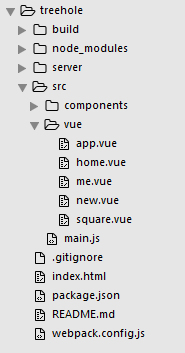
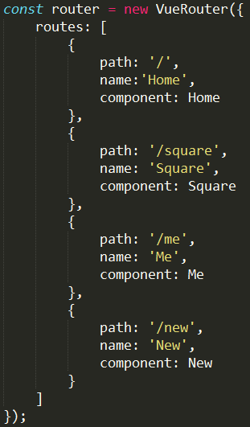
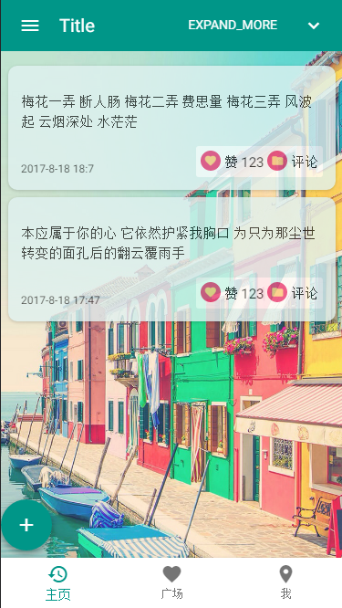
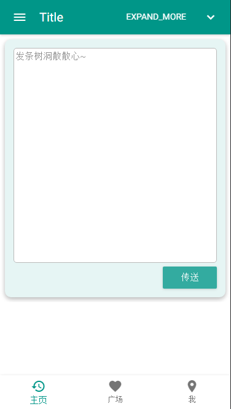

# treehole
觊觎Vue已久，尝试着用它写了个简单页面，确实好用，数据双向绑定、列表循环、单页路由等功能简单易上手，解放了很大工作量，希望后面能进一步深入学习、熟练使用，让它成为我的开发好帮手，哈哈哈~

这是一个树洞，仅在主页实现了对树洞的发表和浏览功能，主要技术栈：

1.前端 

* vue 2.4.2
* vue-router
* vue-resource
* 好看的主题：Muse-UI
* 打包工具：webpack

2.后台

* 便捷的node框架：express
* 数据库：mongodb
* 连接node与mongodb的中间件：mongoose

## 项目结构

#### 项目目录

* build中是打包后的静态资源，即index.html页面中真正引用的资源
* server中存放后台及数据库相关的代码
* src是实际编写的打包前的源文件，主要包含vue组件和主入口JS（main.js）

#### 路由结构

单页应用中，路由功能是非常重要的，在Vue中使用通过vue-router实现起来非常方便：

## 主页（树洞）

#### 树洞列表

读取数据库中已有的树洞，列表展示：

#### 发表树洞

点击传送，新加一条非空树洞到数据库中：

构思欠缺了些，现在仅在主页实现了对树洞的发表和浏览功能，再多点时间的话还有很多需要完善的，现在主要是练练手的目的！